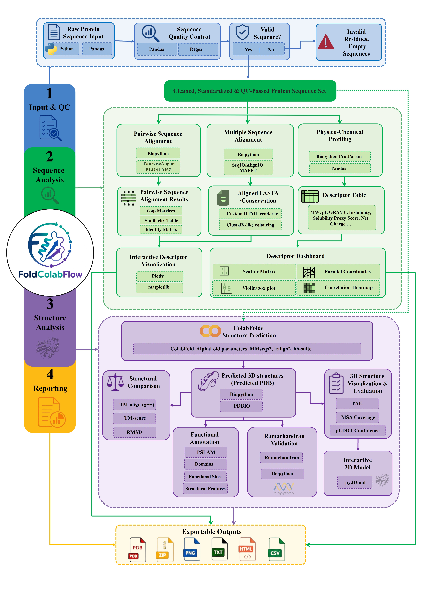

# FoldColabFlow

<p align="center">
  <strong>An integrated Google Colab workflow for protein sequence quality control, comparative sequence analysis, physicochemical profiling, structure prediction, validation, annotation, and reproducible export.</strong>
</p>

<p align="center">
  
  
  
  
</p>

---

<p align="center">
  
</p>

<p align="center">
  <em>FoldColabFlow: integrated sequence-to-structure protein analysis workflow.</em>
</p>

> **Research software status.** FoldColabFlow is being prepared as a citable research software resource. The accompanying manuscript has not yet been accepted; the formal article citation will be added when it becomes available.

## Overview

**FoldColabFlow** is a notebook-first protein analysis pipeline designed to connect sequence-level quality control with downstream sequence, descriptor, and structure analyses in a single reproducible workflow. It supports manually entered protein sequences, performs sequence validation and comparative analyses, computes theoretical physicochemical descriptors, runs ColabFold-based structure prediction, enables structural inspection and validation, and exports publication- and archive-friendly outputs.

The current demonstration package was run on two human protein sequences supplied for the project:

- **P01308 · INS_HUMAN** — 110 aa in the demo input (`Seq_1`)
- **A0A1B0GVQ0 · SPAR_HUMAN** — 90 aa in the demo input (`Seq_2`)

The repository includes representative alignment, physicochemical, structure-prediction, and Ramachandran outputs from this two-protein demonstration.

The demonstration dataset is intentionally kept separate from the PETase-like esterase case study described in the accompanying manuscript. Manuscript-specific sequence and structure files are stored under `manuscript_case_study/` so that the published analyses can be reproduced without mixing them with the general software demo.


## Workflow

FoldColabFlow is organized into four high-level stages: **Input & QC**, **Sequence Analysis**, **Structure Analysis**, and **Reporting**.

## Workflow modules

| Workflow module | Main purpose | Core packages / tools | API / database / resource | Support utilities / UI | Main outputs |
|---|---|---|---|---|---|
| **Input and sequence quality control** | Prepare manually entered protein sequences and flag problematic inputs before downstream analysis. | `pandas`, `re` | User-provided protein sequences | `pathlib`, `html.escape`, `IPython.display` | `sequences`, `seq_names`, `sequence_quality_warning_df` |
| **Sequence alignment and similarity analysis** | Assess sequence-level similarity using pairwise alignment, reference-based comparison, and multiple sequence alignment. | Biopython `Bio.Align.PairwiseAligner`, Biopython substitution matrices, Biopython `AlignIO`, MAFFT, `pandas` | BLOSUM62 substitution matrix; input protein sequences | `itertools`, `base64`, `zipfile`, `datetime`, HTML/CSS, `IPython.display`, `html.escape` | Pairwise summary tables, reference summary, identity/similarity/gap matrices, MAFFT files, MSA summary, HTML alignment report, ZIP archive |
| **Physicochemical profiling and descriptor visualization** | Calculate theoretical sequence-derived descriptors and visualize descriptor patterns. | Biopython `ProteinAnalysis`, `pandas`, Plotly Express, `matplotlib` | Input protein sequences; ProtParam-style descriptor definitions | `math`, `json`, `base64`, `zipfile`, `pathlib`, HTML/CSS, `IPython.display` | Descriptor tables, amino-acid composition files, statistical summaries, interactive HTML plots, manuscript-oriented PNG/SVG figures, HTML report, ZIP archive |
| **Structure prediction and 3D visualization** | Predict 3D protein structures and inspect confidence-coloured structural models. | ColabFold, `colabfold.batch.run`, `download_alphafold_params`, MMseqs2 mode via ColabFold, `py3Dmol` | AlphaFold model parameters; MMseqs2-based MSA generation; optional templates when enabled | `os`, `pathlib`, `glob`, `subprocess`, `zipfile`, Google Colab runtime | Sequence-specific ColabFold folders, predicted PDB files, ranking/score files, pLDDT plots, PAE plots, MSA coverage plots, job ZIP archive, interactive 3D viewer |
| **Structure validation, functional annotation and structural comparison** | Inspect local backbone geometry, infer sequence-level functional/domain annotations, and compare predicted folds. | `ramachandraw`, Biopython `PDBParser`, Biopython `seq1`, `protein-sequence-annotation`, PSALM, TM-align, `pandas` | Predicted PDB structures; PSALM model/resources; TM-align source downloaded at runtime | `g++`, `wget`, `subprocess`, `tempfile`, `glob`, `os`, `re`, `IPython.display` | Ramachandran PNG plots, torsion counts, temporary FASTA files, `psalm_hits.tsv`, functional annotation tables, compiled `TMalign`, TM-score/RMSD comparison tables |
| **Integrated output generation and reproducibility** | Organize, export, and archive workflow outputs for reproducibility and reporting. | `pandas`, `json`, `zipfile`, `base64` | Google Drive storage when mounted; local Colab storage otherwise | HTML/CSS, `IPython.display`, Google Drive mount, notebook-level Python objects | CSV, FASTA, TXT, PDB, PNG, SVG, HTML, JSON, TSV, and ZIP files; structured output folders; report files; notebook DataFrames |

## Key capabilities

### 1. Input and sequence QC
- Manual input for multiple protein sequences.
- Standardization and validation of protein sequences before downstream processing.
- Detection and reporting of invalid residues, empty entries, and sequence-level warnings.

### 2. Sequence alignment and similarity
- Global pairwise alignment with Biopython `PairwiseAligner`.
- BLOSUM62-based similarity scoring with affine gap penalties.
- All-vs-all and optional reference-based summaries.
- Identity, similarity, and gap matrices.
- MAFFT multiple sequence alignment.
- Exportable FASTA, text, CSV, HTML, and ZIP outputs.

### 3. Physicochemical profiling
- Molecular weight and theoretical pI.
- GRAVY and hydropathy-related descriptors.
- Net charge at pH 7 and charge density.
- Instability index, aromaticity, and aliphatic index.
- Extinction coefficients and cysteine content.
- Amino-acid composition.
- A clearly labelled sequence-derived solubility proxy.
- Interactive Plotly visualizations and high-resolution PNG/SVG exports.

### 4. Structure prediction
- ColabFold/AlphaFold2-based structure prediction.
- MMseqs2-based MSA generation.
- Optional template support.
- Per-sequence PDB, score JSON, PAE, pLDDT, and coverage outputs.
- Interactive `py3Dmol` structure viewing.

### 5. Structural validation and annotation
- Ramachandran/backbone torsion analysis.
- PSALM-based functional/domain annotation workflow.
- TM-align structural comparison with TM-score and RMSD extraction.

### 6. Reporting and export
- Structured output directories and downloadable ZIP archives.
- Machine-readable CSV/TSV/JSON outputs.
- Human-readable HTML reports.
- Publication-oriented static figures.
- Notebook DataFrames for direct downstream analysis.

## Quick start

### Recommended environment

FoldColabFlow is designed primarily for **Google Colab**, where the notebook can install or configure the required software during execution. A GPU runtime is strongly recommended for the structure-prediction stage.

### Run the notebook

1. Open `FoldColabFlow.ipynb` in Google Colab.
2. Run the cells from top to bottom.
3. Mount Google Drive if persistent storage is desired.
4. Enter protein sequences in the **Protein Sequence Input** section.
5. Review sequence QC results before continuing.
6. Run alignment and physicochemical modules.
7. Enable a GPU runtime before structure prediction.
8. Run the structure prediction, visualization, Ramachandran, functional annotation, and TM-align modules as required.
9. Download or archive generated outputs.

> **Important:** Some external tools are installed or downloaded at runtime. For manuscript-grade reproducibility, use a tagged FoldColabFlow release and preserve the software-version/configuration files generated by the workflow.

## Demonstration data and reproducibility snapshot

The included demonstration outputs were generated from two sequences (`Seq_1`, 110 aa; `Seq_2`, 90 aa).

### Alignment run

The archived alignment report records:

| Component | Demo value |
|---|---|
| Python | 3.12.13 |
| Biopython | 1.88 |
| pandas | 2.2.2 |
| MAFFT | v7.490 |
| Pairwise mode | Global |
| Substitution matrix | BLOSUM62 |
| Gap model | Affine |
| Gap open / extension | -10.0 / -0.5 |
| MSA strategy | `mafft --auto --amino` |

For the included two-sequence comparison, the archived pairwise summary reports **19.51% full-column identity**, **26.83% full-column similarity**, and **37.40% gap-containing alignment columns** under the recorded settings.

### Structure-prediction run

The supplied ColabFold configuration files record:

| Parameter | Demo value |
|---|---|
| ColabFold | 1.6.2 |
| ColabFold commit | `f41090fe3da60283e682f1f284d2c2a1952c519d` |
| Model type | `alphafold2_ptm` |
| Models | 5 |
| Recycles | 3 |
| MSA mode | `mmseqs2` |
| Templates | Disabled |
| Relaxation | Disabled |
| Ranking | pLDDT |
| Random seed | 0 |

The ColabFold result folders also include upstream-generated `cite.bibtex` files; retain these and cite the relevant upstream methods when publishing results.

## Manuscript case-study data

The PETase-like esterase analyses reported in the accompanying manuscript are maintained separately from the two-protein demonstration dataset.

The six amino-acid sequences used in the manuscript case study (`Seq_1`–`Seq_6`) are provided in:

`manuscript_case_study/PETase_like_esterase_candidates.fasta`

This separation is intentional: `examples/demo/` contains the general FoldColabFlow demonstration, whereas `manuscript_case_study/` contains the exact biological inputs and derived structural files associated with the manuscript.

Predicted structures corresponding to the manuscript case study can be added under:

`manuscript_case_study/`

Recommended filenames are:

- `Seq_1.pdb`
- `Seq_2.pdb`
- `Seq_3.pdb`
- `Seq_4.pdb`
- `Seq_5.pdb`
- `Seq_6.pdb`

Additional manuscript-specific files, including predicted structures and other analysis outputs, can be uploaded directly into `manuscript_case_study/`. This keeps all files associated with the article case study in a single, easy-to-access location.

## Repository layout

A recommended repository organization is:

```text
FoldColabFlow/
├── README.md
├── LICENSE
├── NOTICE
├── CITATION.cff
├── FoldColabFlow_Workflow.png
├── FoldColabFlow.ipynb
│
├── examples/
│   └── demo/
│       └── ... general two-protein demonstration files
│
└── manuscript_case_study/
    ├── PETase_like_esterase_candidates.fasta
    ├── Seq_1.pdb
    ├── Seq_2.pdb
    ├── Seq_3.pdb
    ├── Seq_4.pdb
    ├── Seq_5.pdb
    └── Seq_6.pdb
```

The `examples/demo/` directory should remain dedicated to the general software demonstration. Manuscript-specific files should be placed directly under `manuscript_case_study/`, allowing readers to distinguish the software demo from the exact dataset used in the publication without introducing unnecessary nested folders.

## Outputs

Depending on the enabled modules, FoldColabFlow can generate:

- **Sequence analysis:** FASTA, CSV, TXT, HTML, ZIP
- **Physicochemical analysis:** CSV, JSON, HTML, PNG, SVG, ZIP
- **Structure prediction:** PDB, A3M, JSON, PNG, ZIP
- **Validation and annotation:** PNG, TSV, CSV, TXT
- **Structural comparison:** tabular TM-score/RMSD results
- **Integrated reporting:** HTML reports and structured archives
- **Manuscript case study:** FASTA inputs, predicted PDB structures, and associated reproducibility outputs stored separately under `manuscript_case_study/`

## Scientific scope and limitations

FoldColabFlow integrates established bioinformatics tools; it does not replace experimental validation. Sequence-derived descriptors are theoretical estimates, structure confidence metrics must be interpreted in context, functional annotations are model/resource dependent, and predicted structures should not be treated as experimentally determined coordinates.

This software is intended for research and educational use and has **not** been validated for clinical diagnosis, treatment decisions, or other safety-critical use.

## Citation

If you use FoldColabFlow in a thesis, preprint, paper, report, or other scholarly output, please cite the **software release** using the metadata in `CITATION.cff`.

The accompanying FoldColabFlow manuscript has not yet been accepted. Once a formal article citation and DOI are available, this section and `CITATION.cff` can be updated to make the article the preferred citation.

For a public release, the recommended citation workflow is:

1. Finalize the author list and ORCID identifiers in `CITATION.cff`.
2. Create a versioned GitHub release (for example, `v1.0.0`).
3. Archive that release in Zenodo to obtain a software DOI.
4. Add the DOI to `CITATION.cff` and this README.
5. After the manuscript is published, add the article under `preferred-citation` while keeping the software DOI/version citable.

Please also cite the upstream scientific software and methods used for the analyses, including ColabFold/AlphaFold, MAFFT, Biopython, TM-align, PSALM, and other relevant dependencies, according to their own citation guidance.

## License

FoldColabFlow's original repository code and documentation are released under the **Apache License 2.0**. See [`LICENSE`](LICENSE).

This is a permissive open-source license that allows reuse, modification, and redistribution under its terms. **Academic citation is requested through `CITATION.cff`, but scholarly citation is separate from the software-license conditions.**

Third-party tools, model parameters, databases, downloaded source files, and example data are **not relicensed by FoldColabFlow** and remain subject to their respective upstream licenses and terms. Users are responsible for complying with those terms.

## Contributing

Contributions that improve robustness, reproducibility, documentation, testing, or scientific reporting are welcome. For substantial changes, open an issue first so the scope and expected behavior can be discussed.

## Project status

FoldColabFlow is under active research development. Interfaces, output schemas, dependency versions, and default parameters may change before the first stable release.

---

**FoldColabFlow** — integrated protein sequence-to-structure analysis in a reproducible Colab workflow.
